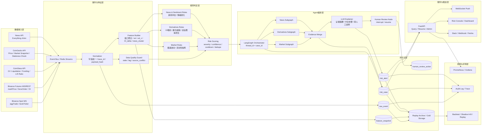
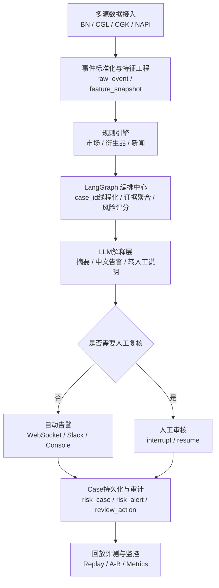

可以。基于你这 5 份设计文档，整体架构我建议定成一版**“事件驱动 + 分层判定 + Case 状态机 + 人工复核闭环”**的架构，而不是普通的“多 Agent 聊天式”架构。你的报告里已经把主链路定得很清楚：**BN/CGL/CGK/NAPI 进入事件总线，LangGraph 负责编排多子图判定，FastAPI 提供查询、订阅与恢复执行接口；规则负责异常判定，LLM 负责新闻聚类、证据摘要、中文告警文案与转人工说明。**

## 我给你的最终架构结论

这套系统最适合采用 **7 层架构**：

1. **数据接入层**
2. **事件与特征层**
3. **规则判定层**
4. **Agent 编排层**
5. **Case / Alert 状态持久化层**
6. **服务接口与推送层**
7. **运维观测与评测层**

这样定的原因，是你的文档本身已经明确了三个核心约束：

- 这是一个**公共市场风控 Agent**，不是自动交易系统，不接私有账户，不做自动下单，只做可解释告警、Case 管理和人工复核。
- 这是一个**规则先行、LLM 辅助解释**的系统，而不是纯 LLM 判定器。
- 这是一个**以 Case 为线程单位的可恢复状态机系统**，需要 checkpoint、interrupt、人审恢复、幂等副作用和去重冷却。

------

## 一、整体架构图

下面这版就是我建议你在 README、汇报 PPT、draw.io、Excalidraw 或 Mermaid 中使用的**主架构图**。

------

## 二、这张图里每一层的职责

### 1）数据接入层

这里不要画成一个“大爬虫盒子”，而是明确 4 类源：

- **BN**：毫秒到秒级市场主源
- **CGL**：跨交易所衍生品主源
- **CGK**：聚合现货校验与陈旧性检查
- **NAPI**：新闻检索与主题聚类输入

这和你文档里的主数据源设计是一致的。尤其 BN 适合做高频事件触发，CGL 用于补全单交易所看不到的跨所杠杆风险，CGK 用于校验聚合价格与陈旧性，NAPI 更适合标题/摘要级主题聚类而不是全文知识库。

### 2）事件与特征层

这是整套系统最关键的一层。
它不只是“清洗数据”，而是把多源原始输入统一成**可审计事件对象**和**窗口特征快照**。

你报告里已经明确了这一层需要完成：

- 标准化并落 raw_event
- 特征补齐与窗口聚合
- freshness / stale / source conflict 检查
- event_ts / ingest_ts / trace_id / payload_hash 统一管理

而且 raw_event、risk_case、risk_alert、human_review_action 这些表的职责也已经在文档里给出来了。

### 3）规则判定层

这一层是主判定层，不是 LLM 层。
建议拆成三个规则域：

- **市场规则**：极速波动、流动性抽离
- **衍生品规则**：OI 堆积、爆仓级联、资金费率挤压、大户拥挤反转
- **新闻/情绪规则**：新闻冲击、情绪持续恶化

然后统一进入 `Risk Scoring`：

- severity
- confidence
- dedupe
- cooldown
- manual_review_if

这和你的风控规则表完全一致。你文档里已经给了风险类型、证据链、优先级和转人工条件，因此图上要单独留出 **Risk Scoring / Decision Gate**，不能把规则判断和 Agent 编排混在一起。

### 4）Agent 编排层

这一层推荐你明确命名为：

**LangGraph Orchestrator**

并在图里标注：

**thread_id = case_id**

因为你的设计报告已经明确建议把 Case 作为长期线程单位；市场、衍生品、新闻/情绪检测子图采用 `per-invocation` 隔离，只有 Case 汇总、人审和后续跟踪使用 `per-thread` 累积状态。

这意味着你的图里应该体现出：

- `Market Subgraph`
- `Derivatives Subgraph`
- `News Subgraph`
- `Evidence Merge`
- `LLM Explainer`
- `Human Review Node`

而不是简单写成“Multi-Agent”。

### 5）持久化层

这一层至少要有 5 个业务实体：

- `raw_event`
- `feature_snapshot`
- `risk_case`
- `risk_alert`
- `human_review_action`

如果你想让图更完整，再加一个：

- `replay archive / cold storage`

因为你的评测方案已经明确要求**从第一天开始全量归档线上原始事件和规则命中结果**，否则后续无法做分钟级回放、离线复盘和 shadow A/B。

### 6）服务与推送层

这里应该只保留三种出口：

- **查询与恢复执行 API**
- **实时推送**
- **人工查看控制台**

所以建议画成：

- FastAPI
- WebSocket Push
- Web Risk Console
- Slack / Webhook / Feishu

你的文档里也明确说了 FastAPI 适合做查询、订阅、恢复执行接口；发送告警节点则负责写 alerts 并推送 API / WebSocket。

### 7）观测与评测层

这是简历感和工程感最强的一层。建议单独画出来，不要藏在角落。

这一层包括：

- Prometheus / Grafana
- Audit Log / Trace
- Replay / Backtest / Shadow A/B

因为你的核心成功标准之一就是：

- 误报可控
- 证据链完整
- 重试可恢复
- 人工通过率逐步提高

这些都依赖观测和评测。

------

## 三、你这套系统的主执行链路

如果要在图下方配一段“架构说明文字”，我建议直接写成下面这段：

**系统从 Binance、CoinGlass、CoinGecko 与 News API 接入市场、衍生品、聚合现货与新闻数据，统一写入事件总线；经过标准化、特征补齐与数据质量检查后，进入市场、衍生品、新闻三类规则子图进行检测；随后由 LangGraph 以 case_id 为线程单位完成证据聚合、风险评分、去重冷却与人工复核编排；高置信度事件直接生成告警，冲突或高风险事件进入人工审核；所有 raw event、feature snapshot、risk case、alert 与人审动作均被持久化并进入回放归档，用于审计、评测与 Shadow A/B。** 这一点与你报告中的“BN/CGL/CGK/NAPI → 事件总线 → LangGraph 多子图判定 → FastAPI 查询/订阅/恢复执行”的主链路完全一致。

------

## 四、这版架构里最关键的 4 个设计决策

### 1. 规则和 LLM 分层

不要让 LLM 做主裁判。
你文档已经把判定哲学定死了：**规则负责异常判定，LLM 负责解释与说明。** 这必须体现在架构图里。

### 2. Case 是核心对象

不是 Alert，不是 Prompt，不是 Session。
核心对象是 **Case**。
因为状态恢复、人审中断、后续追踪、去重合并，全部围绕 `case_id` 展开。

### 3. 子图隔离而不是乱用多 Agent

你的设计里真正有价值的“多 Agent”不是角色扮演，而是**市场 / 衍生品 / 新闻三个子图的隔离执行**。
图上应该体现“并行子图 + 汇聚”，而不是“多个聊天机器人”。

### 4. 数据质量本身也是风险域

这点很多人会漏。
你的规则表里已经明确把“喂价分歧 / 聚合价陈旧 / 源缺失”列为内部 P2 风险，并且可能阻断高优自动告警。这个节点应该在架构图里单独画成 `Data Quality Guard`。

------

## 五、如果你要画“更适合答辩/PPT”的简化版

可以用这一版：

这版适合首页和 PPT；上一版适合 README 和论文式汇报。

------

## 六、我建议你最终采用的图标题

用这个最稳：

**事件驱动型加密货币市场风控 Agent 整体架构图**

副标题可以写：

**多源数据接入、规则判定、LangGraph Case 编排、人工复核与可回放评测闭环**

------

## 七、你下一步最该做的事

你现在不该继续泛化讨论，而是直接进入**画图落地**。
最合理的是我下一条直接给你：

**1）draw.io/Excalidraw 版分区布局说明**
或者
**2）可直接贴进 README 的 Mermaid 最终定稿版**

如果你要，我下一条就直接把这张图整理成**最终可复制的 Mermaid 定稿版**。